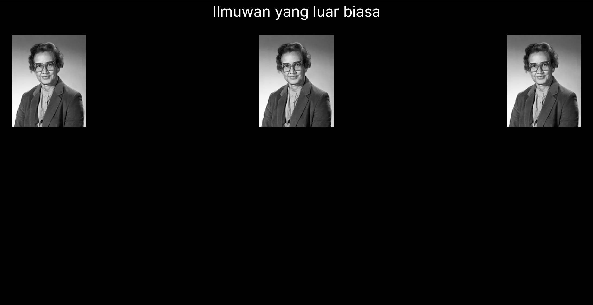
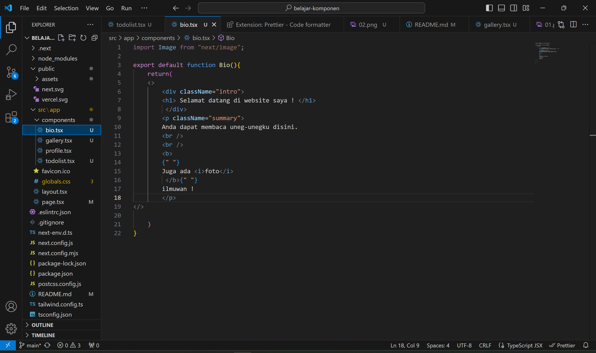
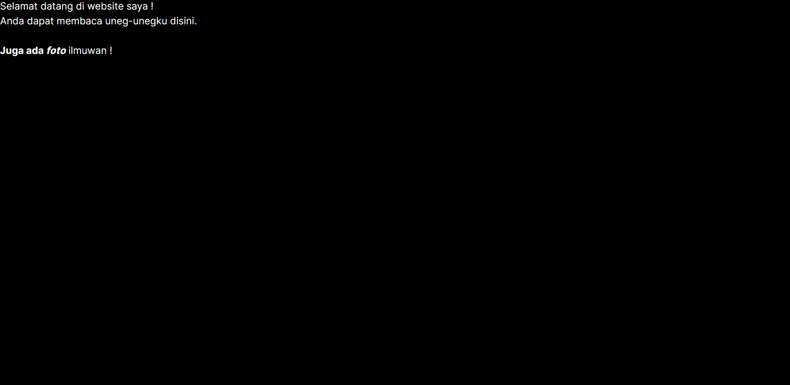
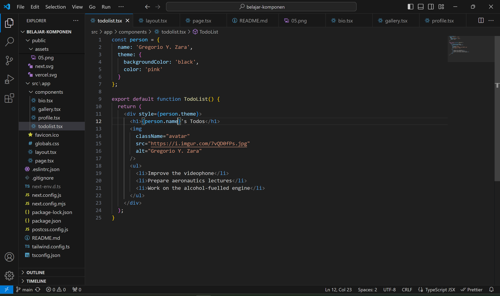
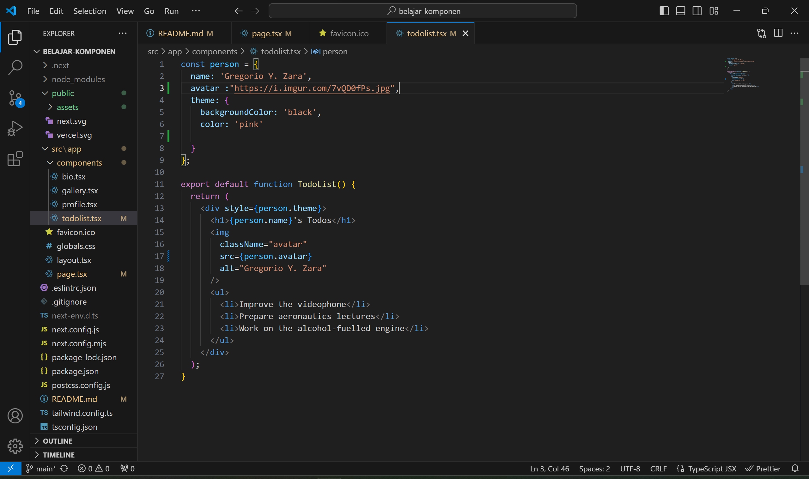
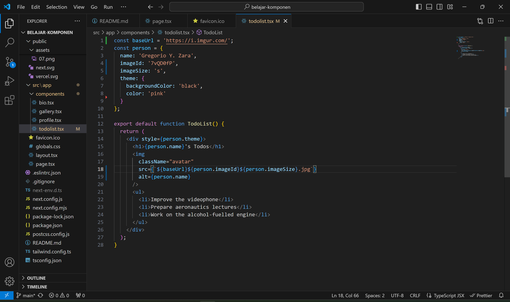
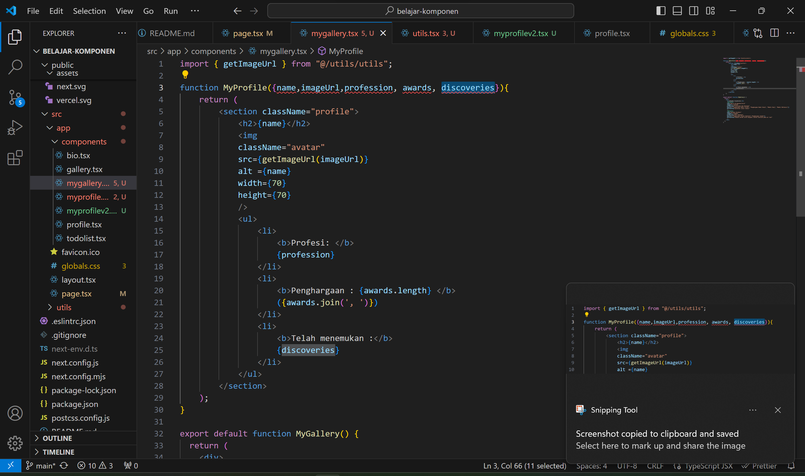
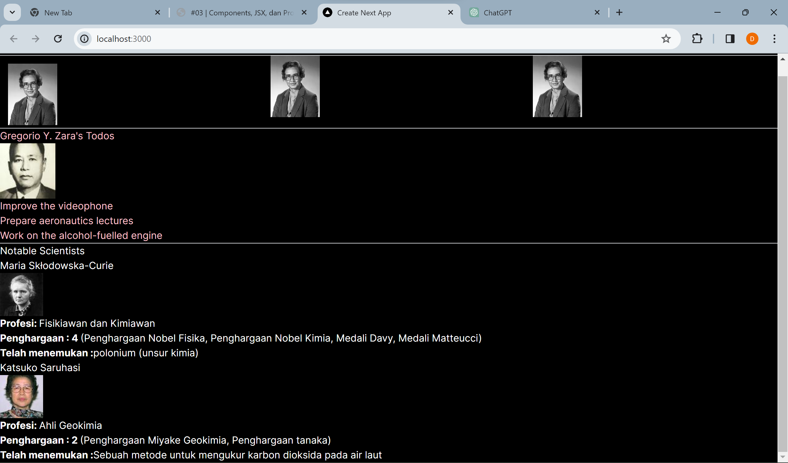

This is a [Next.js](https://nextjs.org/) project bootstrapped with [`create-next-app`](https://github.com/vercel/next.js/tree/canary/packages/create-next-app).

## Getting Started

First, run the development server:

```bash
npm run dev
# or
yarn dev
# or
pnpm dev
# or
bun dev
```

Open [http://localhost:3000](http://localhost:3000) with your browser to see the result.

You can start editing the page by modifying `app/page.tsx`. The page auto-updates as you edit the file.

This project uses [`next/font`](https://nextjs.org/docs/basic-features/font-optimization) to automatically optimize and load Inter, a custom Google Font.

## Laporan Praktikum

|  | Pemrograman Berbasis Framework 2024 |
|--|--|
| NIM |  2141720152|
| Nama |  Khafillah Akbar Syahputra |
| Kelas | TI - 3I |


### Jawaban Soal 1



Contoh perubahan menggunakan komponen Profile

### Jawaban Soal 2


Contoh perubahan menggunakan komponen Gallery

### Jawaban Soal 3


Contoh perubahan dari HTML ke JSX

Hasil Perubahan pada website

### Jawaban Soal 4


Penggunaan JSX Dinamis dan perbaikan kode sebelumnya dimana ditambahkan attribut .name pada person class

### Jawaban Soal 5


Ekstrak URL gambar ke dalam objek person

### Jawaban Soal 6


Perbaikan code sebelumnya, pada src ditambahkan '{}' untuk interpolasi

### Jawaban Soal 7


Perubahan code

Hasil tampilan dari perubahan code. 

Fungsi MyProfile dapat mempersingkat pembuatan avatar karena tinggal memasukkan parameter yang nanti akan diumpan ke fungsi.
